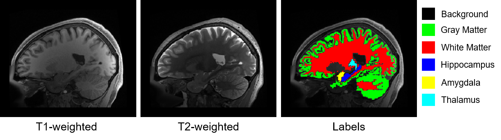

# Clinical Background

### What are we attempting to solve? Alzheimers Disease and Neurodegenerative disorders

**Alzheimer’s disease** is a worsening form of dementia that greatly weakens those who have it and eventually leads to death. It affects up to 15% of people over 65 and nearly half of those by 85. It is marked by the loss of specific brain cells in areas like the hippocampus and the temporal and frontal lobes \[1]. In current clinical practice, diagnosing Alzheimer’s disease (AD) relies on subjective tests and ruling out other types of dementia. Therefore, it’s crucial to find a reliable and specific biomarker for the disease. Such a biomarker should meet clinical standards and help detect the disease early.

###

### How do we solve it?: Image Segmentation

In the **MIA** (which stands for Medical Image Analysis) **Lab**, we attempt to quantify this loss of healthy tissue by segmenting (or classifying each pixel/voxel) relevant structures of the human brain. We focus on the most prominent task, segmentation, and do it in the most prominent area in MIA, the human brain, using magnetic resonance (MR) images.&#x20;

Image segmentation is a process that involves dividing an image into different regions (or segments), each representing a specific anatomical structure or region of interest. This technique is essential for various clinical tasks, including:

1. **Diagnosis**: By isolating specific areas, such as tumors or lesions, doctors can more accurately diagnose conditions.
2. **Treatment Planning**: Segmentation helps in planning surgeries or radiation therapy by clearly defining the boundaries of organs and abnormal growths.
3. **Monitoring Disease Progression**: It allows for precise tracking of changes in size or shape of a disease over time.

On the diagnosis track, segmenting brain structures from MR images is important for tracking progression in neurodegenerative diseases by the atrophy of brain tissue \[2], amongst many other related tasks_._&#x20;

###

### Why are we doing this?: The Unmet Clinical Need

Performing the segmentation task manually is time-consuming, user-dependent, and costly \[3]. Think about being a neuroradiologist who needs to segment the brain of every scanned patient. This is why we aim for an automated machine learning (ML) approach. The pipeline aims to classify each voxel of a brain MR image in one of the following classes:

* 0: Background (or any other structures than the one listed below)
* 1: Cortical and cerebellar white matter
* 2: Cerebral and cerebellar cortex / grey matter
* 3: Hippocampus
* 4: Amygdala
* 5: Thalamus

An example sagittal image slice is shown in the figure below, where the label image (reference segmentation referred to as ground truth or simply labels) is shown next to the two available MR images (T1-weighted and T2-weighted).

<figure><figcaption>
T1 weighted, T2 weighted, and the segmented image on a sagittal slice of the Human Brain.
</figcaption></figure>

###

### References

\[1] Gustaw-Rothenberg K, Lerner A, Bonda DJ, Lee HG, Zhu X, Perry G, Smith MA. Biomarkers in Alzheimer's disease: past, present and future. Biomark Med. 2010 Feb;4(1):15-26. doi: 10.2217/bmm.09.86. PMID: 20387301; PMCID: PMC2855161.

\[2] Pereira, S., Pinto, A., Oliveira, J., Mendrik, A. M., Correia, J. H., Silva, C. A.: Automatic brain tissue segmentation in MR images using Random Forests and Conditional Random Fields. Journal of Neuroscience Methods 270, 111-123, (2016). https://doi.org/10.1016/j.jneumeth.2016.06.017

\[3] Porz, N., Bauer, S., Pica, A., Schucht, P., Beck, J., Verma, R.K., Slotboom, J., Reyes, M., Wiest, R.: Multi-Modal Glioblastoma Segmentation: Man versus Machine. PLoS ONE 9(5), (2014). https://doi.org/10.1371/journal.pone.0096873
