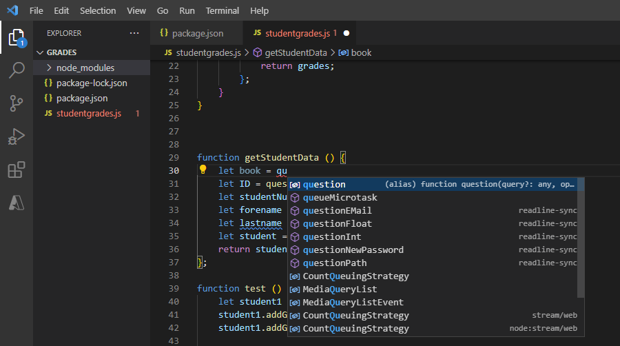
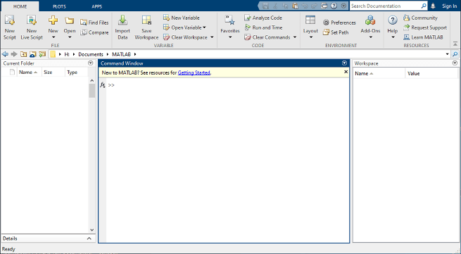

# IDE

### **PyCharm**

We recommend using [JetBrains PyCharm](https://www.jetbrains.com/pycharm/) as an IDE to program in Python. The community edition is open-source and sufficient for our purposes, but you can also access the professional version with a student ID.&#x20;

Follow the [instructions](https://www.jetbrains.com/help/pycharm/requirements-installation-and-launching.html) to install PyCharm.

To open the MIA Lab as project and to configure the Python interpreter do the following:

1. Launch PyCharm
2. Click Open (or File > Open)
3. In the dialog navigate to `</path/to/where/you/have/the/code>/MIALab`
4. Click OK. MIALab is now open as PyCharm project (PyCharm created the `.idea` directory)
5. Click File > Settings... to open the settings dialog.
6. Navigate to Project: MIALab > Python Interpreter. Select the Python interpreter `</path/to/your/anaconda/installation>/envs/mialab/bin/python` (on Linux and macOS) or `<\path\to\your\anaconda\installation>\envs\mialab\python.exe` (on Windows). If the interpreter is not available in the combo box, click the gear icon and choose Add Local and navigate the the files above.
7. Confirm by clicking OK.
8. Open the `test_install.py` (`test`directory) in the navigator.
9. Right click in the editor > Run 'test\_install'. Runs the test\_install and adds a configuration (see top right corner) to the project. You can add configurations manually under Run > Edit Configurations...

For more help, watch the [getting started](https://www.jetbrains.com/pycharm/documentation/) videos to get accustomed with the interface.

### Visual Studio Code

<figure><figcaption>
Credits: <a href="https://learn.microsoft.com/en-us/training/modules/introduction-to-visual-studio-code/2-what-is-visual-studio-code">https://learn.microsoft.com/en-us/training/modules/introduction-to-visual-studio-code/2-what-is-visual-studio-code</a>
</figcaption></figure>

**Visual Studio Code (VS Code)** is a powerful code editor designed for developers. Its interface is user-friendly and includes the following panels:

* **Activity Bar**: Located on the side, it provides quick access to different views like Explorer, Search, Source Control, Run and Debug, and Extensions.
* **Side Bar**: Displays different panels depending on the selected view from the Activity Bar, such as the file explorer or source control.
* **Editor**: The main area where you write and edit your code. It supports multiple tabs, allowing you to work on several files simultaneously.
* **Status Bar**: Found at the bottom, it shows information about the current file, such as encoding, line endings, and language mode.
* **Command Palette**: A powerful tool accessible via a keyboard shortcut, allowing you to execute commands quickly without navigating through menus.
* **Integrated Terminal**: Embedded within the editor, it lets you run command-line tasks without leaving the coding environment.

Microsoft has a [detailed introductory course ](https://learn.microsoft.com/en-us/training/modules/introduction-to-visual-studio-code/)on Visual Studio Code, describing all the relevant features you would likely use in this course.&#x20;

### MATLAB

The **MATLAB Integrated Development Environment (IDE)** from MathWorks is an easy-to-use tool for interactive programming. You will use this IDE only in the situation that you follow the [mia-matlab](https://github.com/ubern-mialab/mia-matlab) repository for the project. Here are the various IDE panels to be familiar with:

<figure><figcaption>
Credits:  <a href="https://ch.mathworks.com/help/matlab/learn_matlab/desktop.html">https://ch.mathworks.com/help/matlab/learn_matlab/desktop.html</a>
</figcaption></figure>

* **Home Tab**: Provides quick access to common tasks like creating scripts, managing files, and setting preferences.
* **Editor Tab**: A dedicated space for writing, editing, and debugging code with syntax highlighting and code folding.
* **Plots Tab**: Offers tools for creating and customizing visualizations.
* **Apps Tab**: Contains a collection of interactive applications for tasks such as data analysis and signal processing.
* **Workspace Panel**: Displays variables and their values, allowing for easy data management.
* **Command Window**: The main area for executing commands and running scripts.
* **Current Folder Panel**: Helps navigate and manage project files.

[Here is an introductory video](https://ch.mathworks.com/videos/introduction-to-matlab-1621968498775.html) describing MATLAB and more features to help you be more productive in your exploration of this course.
