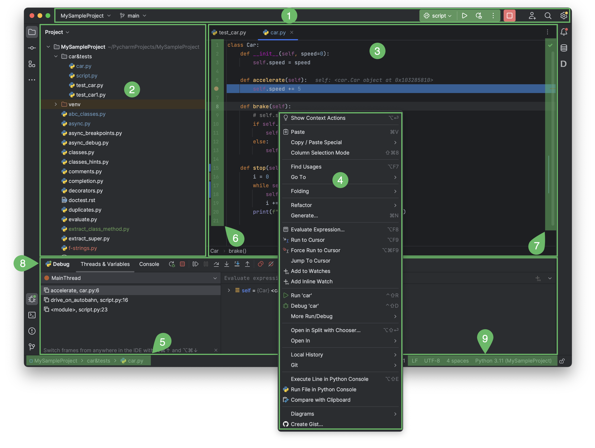
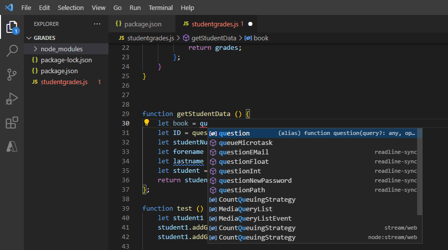
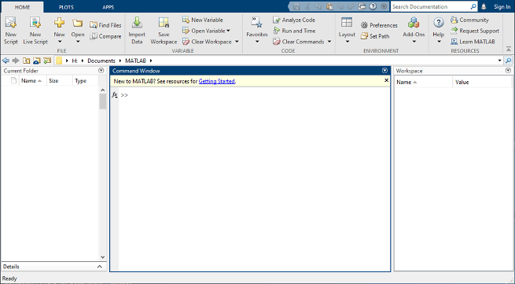

# IDE

### **PyCharm**

<figure><figcaption>
Credits: <a href="https://www.jetbrains.com/help/pycharm/guided-tour-around-the-user-interface.html">https://www.jetbrains.com/help/pycharm/guided-tour-around-the-user-interface.html</a>
</figcaption></figure>

We recommend using [JetBrains PyCharm](https://www.jetbrains.com/pycharm/) to program in Python. The community edition is open-source and sufficient for our purpose, but you can also access the [professional version](https://www.jetbrains.com/products/compare/?product=pycharm\&product=pycharm-ce) with a student ID.&#x20;

Follow the [instructions](https://www.jetbrains.com/help/pycharm/requirements-installation-and-launching.html) to install PyCharm. The interface includes:

1. [Window header](https://www.jetbrains.com/help/pycharm/new-ui.html#window\_header) contains a set of widgets which provide quick access to the most popular actions: project, VCS, and run. It also allows you to open [Settings](https://www.jetbrains.com/help/pycharm/configuring-project-and-ide-settings.html).
2. [Project tool window](https://www.jetbrains.com/help/pycharm/project-tool-window.html) on the left side displays your project files.
3. [Editor](https://www.jetbrains.com/help/pycharm/using-code-editor.html) on the right side, where you actually write your code, with tabs for easy navigation between open files.
4. [Context menus](https://www.jetbrains.com/help/pycharm/guided-tour-around-the-user-interface.html#context-menus) open when you right-click an element of the interface or a code fragment.
5. [Navigation bar](https://www.jetbrains.com/help/pycharm/guided-tour-around-the-user-interface.html#navigation-bar) allows you to quickly navigate the project folders and files.
6. Gutter, the vertical stripe next to the editor, shows the breakpoints you have, and provides a convenient way to [navigate through the code](https://www.jetbrains.com/help/pycharm/navigating-through-the-source-code.html) hierarchy like going to definition/declaration.
7. Scrollbar, on the right side of the editor, constantly monitoring the quality of your code by running [code inspections](https://www.jetbrains.com/help/pycharm/code-inspection.html). The indicator in the top right-hand corner shows the overall status of code inspections for the entire file.
8. [Tool windows](https://www.jetbrains.com/help/pycharm/tool-windows.html) are specialized windows attached to the bottom and the sides of the workspace. They provide access to typical tasks such as project management, source code search and navigation, integration with version control systems, running, testing, debugging, and so on.
9. [The status bar](https://www.jetbrains.com/help/pycharm/guided-tour-around-the-user-interface.html#status-bar) indicates the status of your project and the entire IDE, and shows various warnings and information messages like file encoding, line separator, inspection profile, and so on.

For more help, watch the [getting started](https://www.jetbrains.com/pycharm/documentation/) videos to get accustomed with the interface.

#### MIA Lab in PyCharm

To open the MIA Lab as project and to configure the Python interpreter do the following:

1. Launch PyCharm
2. Click Open (or File > Open)
3. In the dialog navigate to `</path/to/where/you/have/the/code>/MIALab`
4. Click OK. MIALab is now open as PyCharm project (PyCharm created the `.idea` directory)
5. Click File > Settings... to open the settings dialog.
6. Navigate to Project: MIALab > Python Interpreter. Select the Python interpreter `</path/to/your/anaconda/installation>/envs/mialab/bin/python` (on Linux and macOS) or `<\path\to\your\anaconda\installation>\envs\mialab\python.exe` (on Windows). If the interpreter is not available in the combo box, click the gear icon and choose Add Local and navigate the the files above.
7. Confirm by clicking OK.
8. Open the `test_install.py` (`test`directory) in the navigator.
9. Right click in the editor > Run 'test\_install'. Runs the test\_install and adds a configuration (see top right corner) to the project. You can add configurations manually under Run > Edit Configurations...

### Visual Studio Code

<figure><figcaption>
Credits: <a href="https://learn.microsoft.com/en-us/training/modules/introduction-to-visual-studio-code/2-what-is-visual-studio-code">https://learn.microsoft.com/en-us/training/modules/introduction-to-visual-studio-code/2-what-is-visual-studio-code</a>
</figcaption></figure>

**Visual Studio Code (VS Code)** is a powerful code editor designed for developers. Its interface is user-friendly and includes the following panels:

* **Activity Bar**: Located on the side, it provides quick access to different views like Explorer, Search, Source Control, Run and Debug, and Extensions.
* **Side Bar**: Displays different panels depending on the selected view from the Activity Bar, such as the file explorer or source control.
* **Editor**: The main area where you write and edit your code. It supports multiple tabs, allowing you to work on several files simultaneously.
* **Status Bar**: Found at the bottom, it shows information about the current file, such as encoding, line endings, and language mode.
* **Command Palette**: A powerful tool accessible via a keyboard shortcut, allowing you to execute commands quickly without navigating through menus.
* **Integrated Terminal**: Embedded within the editor, it lets you run command-line tasks without leaving the coding environment.

Microsoft has a [detailed introductory course ](https://learn.microsoft.com/en-us/training/modules/introduction-to-visual-studio-code/)on Visual Studio Code, describing all the relevant features you would likely use in this course.&#x20;

#### MIA Lab in VS Code

TODO

### MATLAB

The **MATLAB Integrated Development Environment (IDE)** from MathWorks is an easy-to-use tool for interactive programming. You will use this IDE only in the situation that you follow the [mia-matlab](https://github.com/ubern-mialab/mia-matlab) repository for the project. Here are the various IDE panels to be familiar with:

<figure><figcaption>
Credits:  <a href="https://ch.mathworks.com/help/matlab/learn_matlab/desktop.html">https://ch.mathworks.com/help/matlab/learn_matlab/desktop.html</a>
</figcaption></figure>

* **Home Tab**: Provides quick access to common tasks like creating scripts, managing files, and setting preferences.
* **Editor Tab**: A dedicated space for writing, editing, and debugging code with syntax highlighting and code folding.
* **Plots Tab**: Offers tools for creating and customizing visualizations.
* **Apps Tab**: Contains a collection of interactive applications for tasks such as data analysis and signal processing.
* **Workspace Panel**: Displays variables and their values, allowing for easy data management.
* **Command Window**: The main area for executing commands and running scripts.
* **Current Folder Panel**: Helps navigate and manage project files.

[Here is an introductory video](https://ch.mathworks.com/videos/introduction-to-matlab-1621968498775.html) describing MATLAB and more features to help you be more productive in your exploration of this course.

#### MIA Lab in MATLAB

TODO
