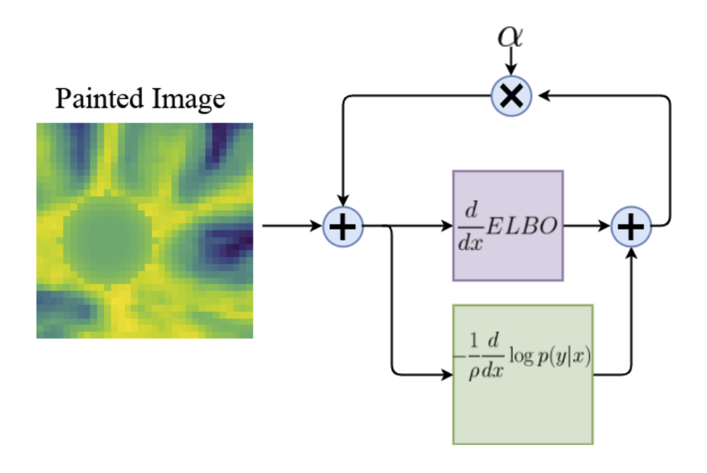
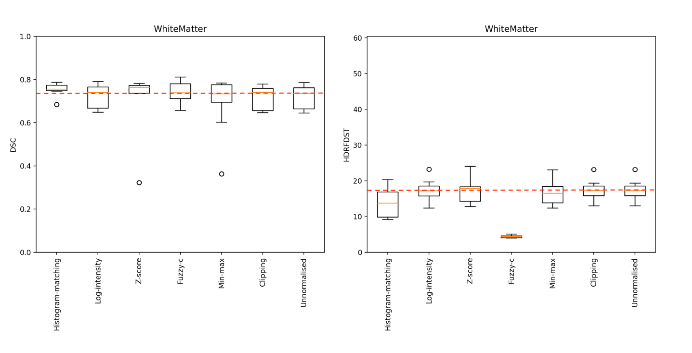

# Visualization

Please consider using the Uni Bern presentation template, from [here](https://ilias.unibe.ch/ilias.php?baseClass=ilrepositorygui\&ref\_id=2042661). Be mindful that the technical content matters significantly more than the presentation aesthetic, and hence minimalistic designs and appropriate time investments in these directions are preferred. It is vital that the level of detail and content must match the experience of the audience/readers. The report you write is technical in nature, hence there is no need to be verbose. However, clarity of results and unambiguous interpretation of metrics and numbers are imperative. To this end, here are some typical elements of the report from a data visualization perspective that we would recommend keeping in mind:

### **Figure 1: graphical abstract**

Include a descriptive figure indicating the experiment design and the flow of data and algorithms/methods, so one can readily understand the broad scope of the report simply by looking at this one figure. In recent publications, this is commonly referred to as a ["graphical abstract"](https://www.elsevier.com/researcher/author/tools-and-resources/graphical-abstract), an example of which is included below.&#x20;

<figure><figcaption></figcaption></figure>

### **Figures in the results section:**

Remember to include labels for all axes in a plot, and include tick labels to indicate what the values are. If you have multiple plots in the same figure, consider using the same range of values (whenever possible, especially when the metric used is the same) so it is easy to read and compare.&#x20;

<figure><figcaption></figcaption></figure>

Also consider highlighting specific results in the plot that you would like to discuss and present supporting (or disproving) your hypothesis. In the example above, the mean DSC and HD95 is indicated with a dashed red line, and this is described further in the text of the report. We appreciate this level of detail.&#x20;

### **Tips**

From our past experience, here are three specific suggestions for visualizations and figures in your report:

1. Including screenshots - consider enlarging the picture as much as possible before taking the screenshot, so the resolution is good enough. We often see pixelated images while zooming in, which makes reading the results difficult. Also consider sizing the image in such a way that the text labels in the image is the same size as the text included in the report otherwise, to look consistent.
2. We prefer fewer plots/figures with notable results rather than crowded subplots with 9x9 panels of really small axes which is hard to read, and also contains information that may not entirely be pertinent to what you are claiming as supporting or disproving your hypothesis. If you feel strongly about these figures, feel free to include them in a supplementary annexure of the report, which is not guaranteed to be read or reviewed (this is also how it works in typical conference submission portals).&#x20;
3. Colors are important - consider using the viridis colormap which is perceptually uniform instead of jet or similar. Also consider colorblind friendly schemes, which can also help if the report is printed and read in grayscale. Note that using similar color schemes across figures (red to highlight important results described in the text, for example) will make the overall reading experience better, leading to a better perception of the quality of the paper itself. Negative results (for the purpose of this course) are as useful to highlight as positive ones.&#x20;

### **Final Presentation template (.pptx):**


