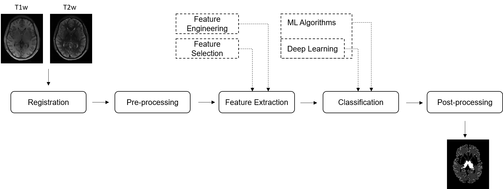

# Pipeline

In a typical medcical image analysis (MIA) process, several sequential algorithmic steps are undertaken, in what is a called a pipeline. This can vary depending on the complexity of the data and the problem statement, and for the purposes of the project in this course, our pipeline has as input two magnetic resonance (MR) image slices (i.e., a T1-weighted (T1w) image slice and a T2-weighted (T2w) image slice) and a segmentation of the brain into constituent structures (see [clinical background](clinical-background.md)).&#x20;

The pipeline itself consists of the following steps, which we will go over through the duration of this laboratory:

* [Pre-processing](../pipeline/pre-processing.md), which aims at improving the image quality for our machine learning algorithm
* [Registration](../pipeline/registration.md), which aims at aligning the two MR images
* [Feature extraction](../pipeline/feature-extraction.md), which aims to extract meaningful features from the MR images for the subsequent classification
* [Classification](../pipeline/voxel-wise-tissue-classification.md), which performs a voxel-wise tissue classification using the extracted features
* [Post-processing](../pipeline/post-processing.md), which aims to improve the classification.

The dashed boxes indicate pre-steps or selections that influence a step. The provided experiments (see [pre-processing](../pipeline/pre-processing.md) and others) correspond to boxes in the figure. Additionally, we will also have a look at the [evaluation](../pipeline/evaluation.md) of such a pipeline.

<figure><figcaption></figcaption></figure>

An in-depth description of the pipeline with references for further reading can be found in \[1].

### References

\[1] Pereira, S., Pinto, A., Oliveira, J., Mendrik, A. M., Correia, J. H., Silva, C. A.: Automatic brain tissue segmentation in MR images using Random Forests and Conditional Random Fields. Journal of Neuroscience Methods 270, 111-123, (2016). https://doi.org/10.1016/j.jneumeth.2016.06.017
